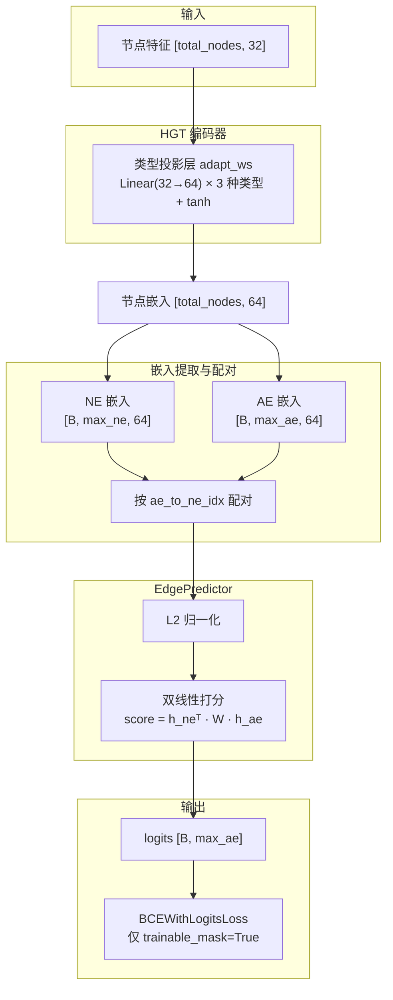

# 告警预测模型设计

## 1. 异构图建模

本模型将网络拓扑和告警关系建模为三层异构图（Heterogeneous Graph），包含三种节点和五类边。每个训练样本是一个独立子图，对应一次故障/隐患事件。支持两种故障模式（mains_failure / link_down）混合出现，并通过噪声注入增强模型鲁棒性。

### 1.1 节点

#### 1.1.1 网元节点（NE）

网元节点表示物理网络设备。每个子图包含事件影响范围内的所有网元。

网元类型共三种：

| 类型         | 编码 | 说明     |
| ------------ | ---- | -------- |
| `wl_station` | 0    | 无线基站 |
| `phy_site`   | 1    | 物理站点 |
| `router`     | 2    | 路由器   |

节点属性包括 `is_an`（是否为告警网元）、`site_id`（站点 ID）、`is_outage`（是否中断）等。

#### 1.1.2 告警实例节点（AlarmEntity）

告警实例节点表示"某网元上的某条告警"，是网元与告警类型的笛卡尔积。ID 格式为 `{alarm_id};{ne_id}`。

每个告警实例携带二元标签 `label`：1 表示该网元 ne_id 上会发生该告警 alarm_id，0 表示不会。其中仅 `ne_is_disconnected` 类型的 AlarmEntity 是模型的预测目标（trainable），其余告警类型（mains_failure、device_powered_off、link_down）作为给定初始条件，不参与损失计算。

#### 1.1.3 告警类型节点（Alarm）

告警类型节点表示告警模板，由配置文件静态定义，共四种：

| 告警 ID              | 关联网元类型 | Domain | 角色                  |
| -------------------- | ------------ | ------ | --------------------- |
| `ne_is_disconnected` | wl_station   | 1002   | 预测目标（trainable） |
| `mains_failure`      | phy_site     | 500    | 初始条件              |
| `device_powered_off` | router       | 600    | 初始条件              |
| `link_down`          | router       | 400    | 初始条件              |

### 1.2 边

| 边类型               | 连接方式            | 说明                     |
| -------------------- | ------------------- | ------------------------ |
| `ne_alarm_entity`    | NE ↔ AlarmEntity    | 网元与其对应的告警实例   |
| `alarm_entity_alarm` | AlarmEntity ↔ Alarm | 告警实例与其所属告警类型 |
| `co_site_ne_ne`      | NE ↔ NE             | 同站网元间的拓扑连接     |
| `cross_site_ne_ne`   | NE ↔ NE             | 跨站网元间的拓扑连接     |
| `self`               | 各节点 ↔ 自身       | 自环边                   |

所有非自环边均自动生成反向边（如 `rev_ne_alarm_entity`）。边类型总数为 4 × 2 + 1 = 9。

---

## 2. 输入数据及特征构造

### 2.1 数据来源

训练数据存储于 JSON 文件，每个文件包含多个子图样本。数据划分为三份：

| 数据集 | 文件                     | 用途           |
| ------ | ------------------------ | -------------- |
| 训练集 | `transformed_train.json` | 模型训练       |
| 验证集 | `transformed_val.json`   | 早停和模型选择 |
| 测试集 | `transformed_test.json`  | 最终评估       |

每个样本记录一次故障事件或隐患事件，包含该事件涉及的所有节点、边和 `fault_or_risk` 站点列表。

#### 故障模式

每个 `fault_or_risk` 站点随机分配一种故障模式：

| 故障模式        | 触发规则                   | 告警影响                                                     |
| --------------- | -------------------------- | ------------------------------------------------------------ |
| `mains_failure` | 站点断电                   | mains_failure=1, device_powered_off=1, ne_is_disconnected=1，下游中断站 ne_is_disconnected=1 |
| `link_down`     | 站点与上游邻居之间链路断开 | 故障站 link_down=1, ne_is_disconnected=1；上游邻居 link_down=1；下游中断站 ne_is_disconnected=1 |

#### 噪声注入

为增强模型鲁棒性，在非故障、非 AN 站点中随机注入 `mains_failure` 噪声。噪声站点仅触发 `mains_failure=1`，不引发下游中断。模型需学会区分噪声 mains_failure 与真正导致中断的故障。

### 2.2 特征构造

所有节点类型共享同一维度的特征向量（32 维），各节点类型填充不同的特征子集。

#### 特征向量布局（32 维）

所有节点类型共享 32 维向量，初始全 0，按节点类型填充不同子集。下表标注每个维度在三种节点类型中的赋值来源：

| 维度    | 名称                    | 说明                                         | NE         | AE                | Alarm                  |
| ------- | ----------------------- | -------------------------------------------- | ---------- | ----------------- | ---------------------- |
| d0      | is_an                   | 是否为业务出口                               | ✓ 直接     | ✓ 继承自关联 NE   | ✗ 恒 0                 |
| d1–d3   | ne_type                 | 网元类型 one-hot（3 类）                     | ✓ 直接     | ✓ 继承自关联 NE   | ✓ 自身 `ne_type` 属性  |
| d4–d6   | role                    | 节点角色 one-hot                             | [1,0,0]    | [0,1,0]           | [0,0,1]                |
| d7–d10  | alarm_id                | 告警类型 one-hot（4 类）                     | ✗ 恒 0     | ✓ 自身 `alarm_id` | ✓ 自身 `alarm_id`      |
| d11     | domain                  | 归一化 domain：log1p(domain) / log1p(max)    | ✗ 恒 0     | ✓ 自身 `domain`   | ✓ 自身 `domain`        |
| d12–d19 | fault_dist              | 到故障触发节点的拓扑距离分桶（8 维 one-hot） | ✓ 直接计算 | ✓ 继承自关联 NE   | ✗ 固定 N/A 桶（d12=1） |
| d20–d27 | an_dist                 | 到告警网元的拓扑距离分桶（8 维 one-hot）     | ✓ 直接计算 | ✓ 继承自关联 NE   | ✗ 固定 N/A 桶（d20=1） |
| d28–d30 | degree                  | 归一化度特征：共站度、跨站度、总度           | ✓ 直接计算 | ✓ 继承自关联 NE   | ✗ 恒 0                 |
| d31     | is_fault_or_risk_anchor | 是否属于故障触发节点站点                     | ✓ 直接     | ✓ 继承自关联 NE   | ✗ 恒 0                 |

#### 距离分桶规则（8 维 one-hot）

| 桶索引 | 含义               |
| ------ | ------------------ |
| 0      | N/A（非 NE 节点）  |
| 1      | 距离 = 0（即自身） |
| 2      | 距离 = 1           |
| 3      | 距离 = 2           |
| 4      | 距离 = 3           |
| 5      | 距离 = 4           |
| 6      | 距离 ≥ 5           |
| 7      | 不可达             |

距离基于 NE 子图（仅含 `co_site_ne_ne` 和 `cross_site_ne_ne` 边）计算 Dijkstra 最短路径。

#### AlarmEntity 特征继承

AlarmEntity 节点继承其关联 NE 的全部特征（距离、度、锚点等），仅将 role 位重置为 AE 角色 [0,1,0]，并额外填充 alarm_id one-hot 和 domain 值。

---

## 3. 输出格式及训练任务

### 3.1 预测目标

模型对每个 AlarmEntity 输出一个标量 logit，表示该告警实例被触发的可能性。虽然模型对所有 AlarmEntity 产生输出，但仅 `ne_is_disconnected` 的预测参与损失计算和指标评估，其余告警类型的标签由规则确定。

- **输出张量形状**：`[B, max_ae]`，其中 `B` 为 batch 大小，`max_ae` 为 batch 内最大 AlarmEntity 数量
- **业务含义**：logit 经 sigmoid 后 > 0.5 表示预测该告警会被触发

### 3.2 损失函数

使用 `BCEWithLogitsLoss`（二元交叉熵 + Sigmoid），仅在 `trainable_mask` 为 True 的位置计算损失。

### 3.3 trainable_mask 规则

仅 `ne_is_disconnected` 类型的 AlarmEntity 参与训练（`trainable_mask = True`），其余三种告警类型（`mains_failure`、`device_powered_off`、`link_down`）的 AlarmEntity 均被排除（`trainable_mask = False`）。

排除原因：这三种告警作为故障的初始条件，其标签可由规则直接推导（故障站点必然触发对应告警），不需要模型学习。模型仅需学习预测下游 `ne_is_disconnected` 的传播模式。

### 3.4 负采样

训练时支持可选的负采样（`neg_pos_ratio` 参数），对 trainable 范围内的负例进行下采样以平衡正负比例。

---

## 4. 模型架构

### 4.1 整体结构

模型由两部分组成：HGT 编码器和 EdgePredictor 输出头，封装为 `HGTForLinkPrediction`（继承 HuggingFace `PreTrainedModel`）。



### 4.2 HGT 编码器

基于 pyHGT 实现，核心参数：

| 参数          | 值   | 说明                        |
| ------------- | ---- | --------------------------- |
| in_dim        | 32   | 输入特征维度                |
| n_hid         | 64   | 隐藏层维度                  |
| num_layers    | 4    | HGTConv 层数                |
| n_heads       | 4    | 注意力头数（每头 d_k = 16） |
| dropout       | 0.2  | Dropout 比例                |
| num_types     | 3    | 节点类型数                  |
| num_relations | 9    | 边类型数（含反向边和自环）  |

### 4.3 EdgePredictor 输出头

采用双线性打分机制，对 NE-AlarmEntity 节点对计算连接分数：

```
score = normalize(h_ne)ᵀ · W · normalize(h_ae)
```

其中 `W ∈ R^{64×64}` 为可学习参数矩阵，两侧嵌入经 L2 归一化后计算内积。输出为标量 logit。

### 4.4 参数量（默认配置）

按当前默认配置 `in_dim=32`、`n_hid=64`、`num_layers=4`、`n_heads=4` 计算，`HGTForLinkPrediction` 的可训练参数总量为 **284,380**。

最终总账如下：

| 模块             | 计算                 | 参数量  |
| ---------------- | -------------------- | ------- |
| `输入编码层`     | `3 x (64 x 32 + 64)` | 6,336   |
| `HGT第1层`       | `68,391`             | 68,391  |
| `HGT第2层`       | `68,391`             | 68,391  |
| `HGT第3层`       | `68,391`             | 68,391  |
| `HGT第4层`       | `68,391 + 384`       | 68,775  |
| `链接预测输出头` | `64 x 64`            | 4,096   |
| 总计             |                      | 284,380 |


```text
总参数量
= 3 × (64×32 + 64)
+ 3 × [ 12×(64×64 + 64) + (9×4) + 2×(9×4×16×16) + 3 ]
+ [ 12×(64×64 + 64) + (9×4) + 2×(9×4×16×16) + 3 + 3×(64+64) ]
+ (64×64)
= 6,336 + 205,173 + 68,775 + 4,096
= 284,380
```

### 4.5 与标准 HGT 的差异

| 方面   | 标准 HGT             | 本模型                                         |
| ------ | -------------------- | ---------------------------------------------- |
| 输出头 | Classifier / Matcher | 自定义 EdgePredictor（L2 归一化 + 双线性打分） |


---

## 5. 模型训推

### 5.1 训练框架

基于 HuggingFace Transformers Trainer，自定义 `LinkPredictionTrainer` 重写了 DataLoader 创建和指标收集逻辑。

关键训练参数（默认配置）：

| 参数            | 值                          |
| --------------- | --------------------------- |
| 优化器          | AdamW（Trainer 默认）       |
| 学习率          | 5e-5（Trainer 默认）        |
| Epochs          | 40                          |
| Batch size      | 32                          |
| 早停            | patience=15，监控 eval_loss |
| 模型选择        | 最佳 eval_loss              |
| Checkpoint 保留 | 最近 3 个                   |

### 5.2 Mini-batch 策略

由于每个子图的节点数量不同，直接 batch 会产生大量 padding 浪费。采用两层策略：

1. **BucketBatchSampler**：按子图节点总数排序后分桶，将大小接近的子图分入同一 batch，减少 padding 开销
2. **padding_collate_fn**：仅按 batch 内最大 `AlarmEntity` 数量 `max_ae` 对齐输出槽位。若某个样本的 AlarmEntity 数少于 `max_ae`，则只补充孤立的 padding `AlarmEntity` 节点；这些 padding `AlarmEntity` 不与任何 `NE` 建立边连接，仅保留自环。其 `owner_ne_index` 仅作为张量配对时的占位索引，复用该样本中的第一个真实 `NE`，并通过 `owner_is_padding=True` 与 `trainable_mask=False` 保证不会参与训练或评估。节点特征拼为 `[total_nodes_in_batch, 32]`，边索引全局偏移后合并

### 5.3 评估指标

#### Edge-level 指标（全局 flatten）

- AUC、AP（Average Precision）
- F1（阈值 0.5）、Best F1（扫描阈值 0.0–1.0）
- P@K、Recall@K、nDCG@K（K=5, 10, 20, 50）
- MRR

#### Graph-level 指标（逐图计算，仅 trainable AlarmEntity）

- **Graph Accuracy**：所有 trainable AlarmEntity 预测完全正确的子图比例
- **Graph Perfect/1FP**：零漏报且误报 ≤ 1 的子图比例

---

## 6. 技术卡点
